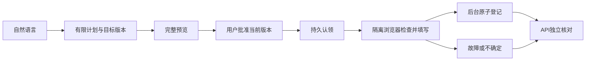

# OfficeFlow 架构与验收

状态：本地实现和运行证据已有；独立 Review 修复进行中；云资源、CI、生产业务回读待验。工作台采用 CSR，不宣称 SSR。

有限自然语言提案只提取需求编号、部门、物品和数量。请求只允许一个明确数字数量；范围、限定词、汉字第二数量及取消/撤销/否定登记要求改写。模型没有 URL、选择器、执行权限。提案来源是实际的 `bounded-rule`、`ollama` 或 `workers-ai`。本地可选已安装的 Ollama，云端模型默认关闭；不可用、超时、字段不匹配时返回规则提案。二十个固定合成用例只是回归样本。

同一需求修订通过旧 revision/hash 的 CAS 保存新版本、字段差异并清除旧批准，重新读取目标版本。需求编号和执行键不变；执行中、已产生效果或 UNKNOWN 不允许改版。修订本身没有登记副作用。

执行证明分为批准匹配、浏览器实际 DOM/字段/POST/回执观察、数据库持久效果、fresh API 字段核对。每层独立；POST 不代表写入，页面成功标记不代表 API 验收。当前运行若通过已有登记去重而没有浏览器动作，会保留无证据状态。白名单报告去掉 capability/cookie/原始表单，SHA-256 digest 仅验证报告内容完整性，不是签名。实现与边界见 [proof.md](./proof.md)。

Playwright TS 是唯一浏览器底座。使用全新上下文，只允许固定同源旧后台路由；DOM 缺失/重复、跳转、弹窗、参数变化会停止。浏览器的 30 秒 capability 只能填写批准的表单，不能批准计划。登记端再次验证批准、内容哈希、目标版本、adapter、有效期和运行状态。

本地 SQLite 和云端 D1 使用独立实现。稳定业务键是租户加需求编号；数据库唯一键限制重复效果。执行认领使用 epoch CAS，后台登记和效果记录在原子事务中完成。结果不确定只查询原需求，不换 key 自动重写。取消不撤销已发生登记。35 秒执行租约过期后允许保守恢复为 UNKNOWN。

签名 HttpOnly 会话建立独立合成体验租户，CSRF 与 Origin 检查保护修改请求。这是公开体验的隔离机制，没有企业 SSO 集成。会话重连必须清掉旧租户缓存；旧会话迟到响应不得合并到新工作区。

云端计划使用 Pages Git Integration、Pages Functions service binding、Browser Worker、D1。Chrome 导航目标仍须是公开 HTTPS 旧后台，不能导航内部 binding。预览使用独立 Worker/D1。免费额度未现场核实前不启用云模型或宣称生产成功；预算限制为浏览器每天 6 次、启动间隔 30 秒，模型每天最多 12 次，session/proposal 各每天 200 次。预算是本应用上限，不能代表账户其他项目的剩余额度。

对照参考采用主仓库和官方文档：

- [Playwright](https://github.com/microsoft/playwright)：Apache-2.0；采用定位、自动等待和网络控制。
- [browser-use](https://github.com/browser-use/browser-use)：MIT；参考观测与受限动作循环，未接入 Python 编排层或付费 hosted 服务。
- [Skyvern](https://github.com/Skyvern-AI/skyvern)：AGPL-3.0；只作架构参考，未复制实现。
- [Cloudflare Playwright](https://developers.cloudflare.com/browser-run/playwright/)、[免费限制](https://developers.cloudflare.com/browser-run/limits/)、[Pages bindings](https://developers.cloudflare.com/pages/functions/bindings/)、[Workers AI pricing](https://developers.cloudflare.com/workers-ai/platform/pricing/)。

验收分为本地确定性测试、独立源码审查、真实 CI、预览和生产回读。静态 Evidence 页面和本地截图不能替代生产浏览器登记、数据库效果与 API 核对。公开收据只含合成数据、版本、统计与结果，不含 cookie、capability、密钥或原始客户资料。
